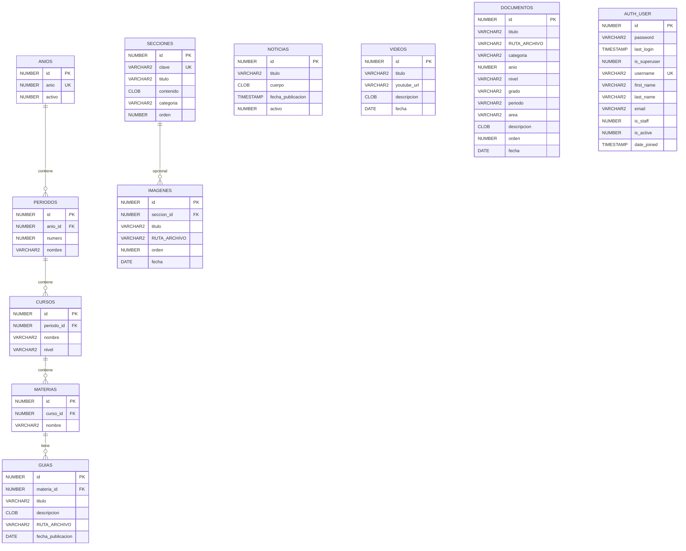

# Athena — Documentación de Base de Datos

> **Fecha:** 2026-09-22  
> **Proyecto:** Athena (I.E.D. CEIS Sopó)  
> **Estado:** Migración en curso (Cloud Run caído → Oracle VPS)

---

## 1. Diagrama Entidad-Relación



---

## 2. Tablas del Sistema (Django Auth)

| Tabla | Propósito | Notas |
|---|---|---|
| `auth_user` | Usuarios del sistema | El rector es superusuario |
| `auth_group` | Grupos de permisos | No usado actualmente |
| `auth_permission` | Permisos granulares | Django standard |
| `auth_user_groups` | Relación user-group | Vacía |
| `auth_user_user_permissions` | Permisos directos | Vacía |
| `django_admin_log` | Log de acciones del admin | Activo |
| `django_session` | Sesiones HTTP | Activo |
| `django_content_type` | Tipos de contenido | Django standard |
| `django_migrations` | Historial de migraciones | 7 migraciones aplicadas |

---

## 3. Tablas de Negocio (Athena)

### 3.1 Jerarquía Académica (Catálogo)

| Tabla | Descripción | Registros (prod) | FK Padre |
|---|---|---|---|
| `ANIOS` | Años académico (2023-2026) | 4 | — |
| `PERIODOS` | Períodos 1-4 por año | 14 | `ANIOS.id` |
| `CURSOS` | Grados/curso (1°-11°, Preescolar) | 66 | `PERIODOS.id` |
| `MATERIAS` | Materias por curso | 495 | `CURSOS.id` |
| `GUIAS` | Guías PDF por materia | 874 | `MATERIAS.id` |

**Cardinalidad:** 1 Año → N Períodos → N Cursos → N Materias → N Guías

### 3.2 Contenido Independiente

| Tabla | Descripción | Registros (prod) | Uso |
|---|---|---|---|
| `NOTICIAS` | Anuncios del colegio | Variable | Web pública (home) |
| `VIDEOS` | Links de YouTube | Variable | Web pública (galería) |
| `SECCIONES` | Textos editables (misión, visión, etc.) | 18+ | Web pública + páginas institucionales |
| `IMAGENES` | Galería fotográfica | 124+ | Web pública (galería por sección) |
| `DOCUMENTOS` | Documentos institucionales (circulares, guías SERC, horarios, formatos, manuales) | 887 | Hub "Circulares, Cronograma y Guías" |

---

## 4. Registro de Cuentas / Usuarios

### 4.1 Cuenta de Administrador (Rector)

| Campo | Valor |
|---|---|
| **Username** | `rector` |
| **Email** | `iedceis@gmail.com` |
| **Rol** | Superusuario (is_superuser=True, is_staff=True) |
| **Estado** | Activo (is_active=True) |
| **Último login** | 2026-08-18 16:51:16 UTC |
| **Creado** | 2026-07-28 19:31:11 UTC |
| **Grupos** | Ninguno |
| **Permisos directos** | Ninguno (usa superuser=all) |

> **NOTA DE SEGURIDAD:** La contraseña está hasheada con PBKDF2 (Django standard).  
> **NO** se documenta aquí. Para reset: `python manage.py changepassword rector`

### 4.2 Cuentas de Base de Datos (Oracle ADB)

| Cuenta | Rol | Propósito | Estado |
|---|---|---|---|
| `ADMIN` | Administrador ADB | Usuario principal de la aplicación | **CAÍDO** — ADB detenida (ORA-12514, 2026-07-21) |
| `rector` (Django) | Superusuario app | Login al Panel del Rector | Activo en SQLite local |

### 4.3 Cuentas de Servicios Cloud

| Servicio | Cuenta/Proyecto | Estado | Nota |
|---|---|---|---|
| **Google Cloud Run** | `gen-lang-client-0454730768` | **CAÍDO** — Servicio detenido, dominio no responde |
| **Oracle Autonomous DB** | `athena_high` (sa-bogota-1) | **CAÍDO** — ADB stopped, wallet en `~/oracle/athena-wallet` |
| **Google Cloud Storage** | Bucket `athena-media-ceis` | **¿?** — Depende de proyecto GCP (mismo billing que Cloud Run) |
| **Cloudflare** | `athena.maxstudio.lat` | **CAÍDO** — Proxy DNS apunta a Cloud Run caído |
| **GitHub** | `jd5073356-max/athena-ceis` | Activo | Repo privado, 178 archivos |

---

## 5. Estado de la Migración (2026-09-22)

### 5.1 Situación Actual

| Componente | Estado | Detalle |
|---|---|---|
| Cloud Run (GCP) | **CAÍDO** | Servicio `athena` en `southamerica-west1` responde HTTP 500 (error interno). URL `.run.app` caída. |
| Oracle ADB | **CAÍDO** | Listener TCP/SSL responde pero servicio no se registra (ORA-12514). Requiere reinicio desde OCI Console. |
| maxstudio.lat | **CAÍDO** | Dominio apunta a Cloud Run caído. Cloudflare proxy devuelve error de origen. |
| SQLite (local) | **ACTIVO** | `db.sqlite3` en `~/proyectos/athena/` funciona para desarrollo. |

### 5.2 Plan de Migración a Oracle VPS

Según `DEPLOY.md`, las opciones son:

1. **OCI Compute / VPS** — Docker + nginx/Caddy + Oracle ADB (si se reactiva)
2. **Railway / Render** — PaaS con wallet como secret file
3. **Reactivar Cloud Run** — Si se paga el saldo GCP y se reinicia el servicio

**Bloqueantes identificados:**
- Oracle ADB está detenida → necesita reinicio manual en OCI Console
- GCP tiene saldo pendiente COP 55,244 → riesgo de suspensión de billing
- Wallet Oracle en `~/oracle/athena-wallet` — verificar si sigue válido
- Bucket GCS `athena-media-ceis` — verificar si sigue accesible

### 5.3 Datos en Riesgo

| Tipo | Ubicación | Estado | Riesgo |
|---|---|---|---|
| Estructura BD (tablas) | Oracle ADB | Detenida pero persistente | Bajo (ADB conserva datos al detenerse) |
| Documentos PDF (887) | GCS `athena-media-ceis` | ¿? | Medio (si se borra bucket o proyecto) |
| Imágenes galería (124) | GCS `athena-media-ceis` | ¿? | Medio |
| Datos locales | `db.sqlite3` | Activo | Bajo (solo desarrollo) |
| Código fuente | GitHub `athena-ceis` | Activo | Mínimo |

---

## 6. Esquema Oracle (DDL de Referencia)

Ver archivo completo: `base-de-datos/esquema_oracle.sql`

**Resumen de tablas Oracle:**

```sql
-- Jerarquía académica
ANIOS       (id, anio, activo)
PERIODOS    (id, anio_id, numero, nombre)
CURSOS      (id, periodo_id, nombre, nivel)
MATERIAS    (id, curso_id, nombre)
GUIAS       (id, materia_id, titulo, descripcion, RUTA_ARCHIVO, fecha_publicacion)

-- Contenido independiente
NOTICIAS    (id, titulo, cuerpo, fecha_publicacion, activo)
VIDEOS      (id, titulo, youtube_url, descripcion, fecha)
SECCIONES   (id, clave, titulo, contenido)
IMAGENES    (id, titulo, RUTA_ARCHIVO, fecha)
DOCUMENTOS  (id, titulo, RUTA_ARCHIVO, categoria, anio, nivel, grado, periodo, area, descripcion, orden, fecha)
```

**Índices:**
- `ix_periodos_anio`   → `PERIODOS(anio_id)`
- `ix_cursos_periodo`  → `CURSOS(periodo_id)`
- `ix_materias_curso`  → `MATERIAS(curso_id)`
- `ix_guias_materia`   → `GUIAS(materia_id)`

---

## 7. Variables de Entorno Críticas

| Variable | Valor Actual (prod) | Sensibilidad |
|---|---|---|
| `DJANGO_SECRET_KEY` | `athena-secret-key` (Secret Manager) | **ALTA** |
| `ORACLE_PASSWORD` | `athena-oracle-password` (Secret Manager) | **ALTA** |
| `ORACLE_WALLET_PASSWORD` | `athena-wallet-password` (Secret Manager) | **ALTA** |
| `athena-bundle` | Wallet + OCI config (Secret Manager) | **ALTA** |

> **NO** están en el repo. Se inyectan en runtime por Secret Manager.

---

## 8. Checklist para Reactivación

- [ ] Verificar estado de Oracle ADB en OCI Console (¿stopped? ¿needs start?)
- [ ] Verificar saldo GCP y estado de billing (`billingAccounts/017449-18BBBB-8EA70A`)
- [ ] Verificar bucket GCS `athena-media-ceis` accesible
- [ ] Validar wallet Oracle en `~/oracle/athena-wallet` (¿no corrupto?)
- [ ] Decidir destino: ¿Reactivar Cloud Run? ¿Migrar a OCI VPS? ¿Railway/Render?
- [ ] Si migración: exportar datos de Oracle ADB (si arranca) o reimportar desde GCS
- [ ] Actualizar `ALLOWED_HOSTS` y DNS si cambia dominio/infraestructura
- [ ] Probar subida/descarga de archivos post-migración
- [ ] Resetear contraseña del rector si es necesario

---

*Documento generado automáticamente para auditoría y migración.*
