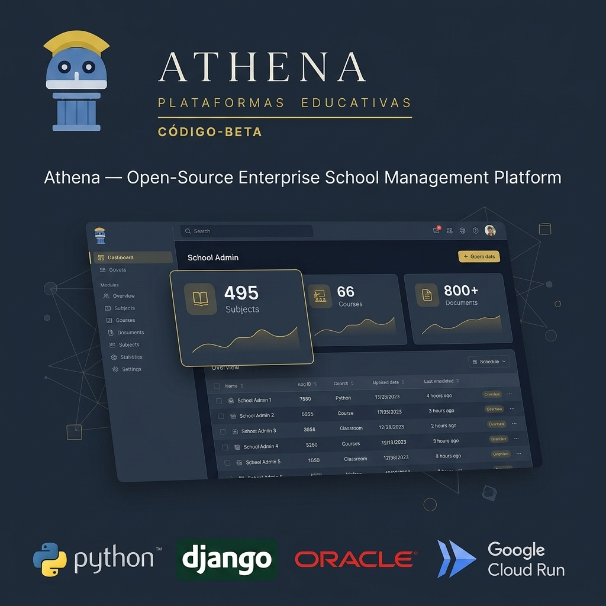

  

# Athena — Enterprise School Management Platform

Plataforma de gestión escolar centralizada construida con Django en Google Cloud Run y base de datos Oracle Enterprise. 

Cuenta con 12 módulos administrativos funcionales en producción que automatizan la gestión de 495 asignaturas, 66 cursos y más de 800 documentos académicos de rectoría.

- **Demo en producción:** [athena.maxstudio.lat](https://athena.maxstudio.lat)
- **Stack:** Python, Django, Oracle Database, Google Cloud Run, Google Cloud Storage, HTML5/CSS3.
