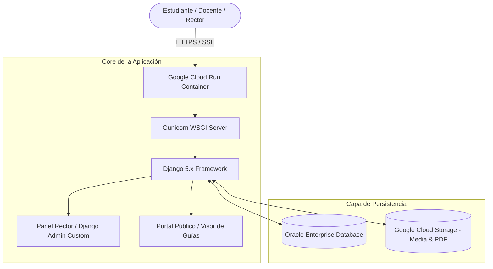

<p align="center">
  
</p>

# Athena — Enterprise School Management Platform

[](https://athena.maxstudio.lat)
[](https://python.org)
[](https://djangoproject.com)
[](https://oracle.com)
[](https://cloud.google.com/run)

> **Plataforma de gestión escolar centralizada.** Sistema administrativo de alto rendimiento desarrollado en Django y desplegado sobre Google Cloud Run con base de datos Oracle Enterprise, diseñado para la administración integral de instituciones educativas de gran escala.

- **Demo en vivo:** [athena.maxstudio.lat](https://athena.maxstudio.lat)

---

## 🎯 ¿Por qué existe Athena? (La Problemática)

Las instituciones educativas de nivel básico y secundario manejan una carga documental crítica que suele gestionarse en hojas de cálculo desconectadas o carpetas físicas. Esto genera:
1. **Ineficiencia en la asignación académica:** Asignar docentes a más de 400 asignaturas y 60 cursos sin un sistema centralizado resulta propenso a duplicidades y conflictos de horario.
2. **Pérdida de material pedagógico:** Cuestionarios, talleres y guías de estudio dispersos sin control de versiones ni repositorio accesible para los estudiantes.
3. **Falta de métricas rectorales:** La dirección institucional carece de visibilidad instantánea sobre el estado de avance de las guías y la actividad docente.

---

## ⚡ ¿Para qué sirve? (El Propósito y Valor)

**Athena centraliza y automatiza toda la operación académica de la institución:**
- **Gestión de Cargas Académicas:** Control estructurado de **495 asignaturas** y **66 cursos** con jerarquía clara por áreas del conocimiento.
- **Repositorio Inteligente de Documentos:** Repositorio centralizado con más de **800 documentos académicos** descargables y clasificables por año, periodo y grado.
- **Panel de Rectoría y Control:** Panel de administración personalizado (`panel_rector`) con métricas clave, control de publicaciones e importación masiva desde Google Cloud Storage (GCS).

---

## 🏗️ Arquitectura de Infraestructura en la Nube



---

## 🧩 Módulos Principales

| Módulo | Descripción Técnica |
|---|---|
| **Core & Catálogo** | Modelos relacionales para Asignaturas, Cursos, Guías, Secciones e Imágenes. |
| **Panel Rector** | Interfaz personalizada para alta dirección escolar, reportes y métricas de avance. |
| **Importador GCS** | Comando personalizado de gestión (`construir_catalogo.py`) para sincronizar miles de PDFs desde Google Cloud Storage. |
| **Visor Web Público** | Navegación responsiva de guías por grado, periodo académico y área académica. |

---

## 🛠️ Stack Tecnológico

- **Lenguaje:** Python 3.11+
- **Framework Web:** Django 5.x
- **Base de Datos:** Oracle Enterprise Database (cx_Oracle / oracledb)
- **Infraestructura:** Google Cloud Run (Serverless Container), Docker
- **Almacenamiento:** Google Cloud Storage (GCS)
- **Frontend:** HTML5, Vanilla CSS3 (Custom Design System), JavaScript

---

## 🔑 Variables de Entorno (`.env`)

```env
SECRET_KEY=tu_django_secret_key_super_segura
DEBUG=False
ALLOWED_HOSTS=athena.maxstudio.lat,localhost

# Base de Datos Oracle
DB_NAME=XE
DB_USER=athena_admin
DB_PASSWORD=tu_oracle_password
DB_HOST=oracle.internal.host
DB_PORT=1521

# Google Cloud Storage
GS_BUCKET_NAME=athena-media-bucket
GOOGLE_APPLICATION_CREDENTIALS=/path/to/gcp-key.json
```

---

## 🚀 Instalación y Despliegue

```bash
# 1. Clonar el repositorio
git clone https://github.com/jd5073356-max/athena-ceis.git
cd athena-ceis

# 2. Crear entorno virtual
python -m venv venv
source venv/bin/activate

# 3. Instalar dependencias
pip install -r requirements.txt

# 4. Migraciones e inicio
python manage.py migrate
python manage.py runserver
```

---

## 👤 Autor

**Juan David Herrera**  
*AI Automation Engineer | Product Engineer · AI, Systems & Web3*  
Bogotá, Colombia  
- **GitHub:** [@jd5073356-max](https://github.com/jd5073356-max)  
- **LinkedIn:** [linkedin.com/in/juan-david-herrera](https://linkedin.com)
